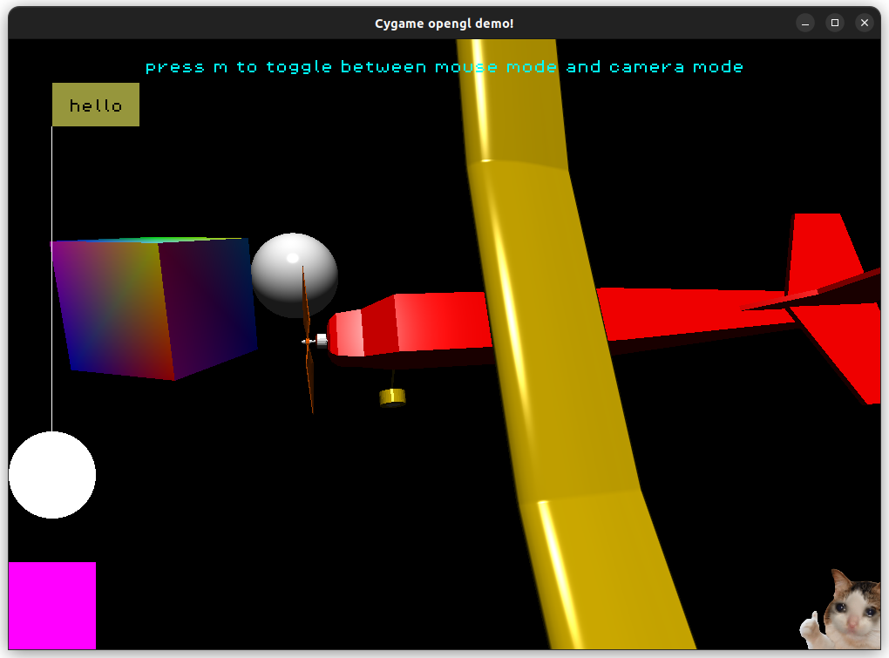

# Cygame

- This was my attempt at making a library kind of like pygame, but in c++. This uses sdl2 and opengl. My main goal was to create easy helper functions and macros around the commonly used stuff in sdl, like the initialisation, input events, or drawing lines, rectangles and circles.
- I then extended that goad and decided to add support for 3d rendering with opengl shaders, which I have achieved, with the shaders being quite simple at the moment.
- I'm also working on creating some useful ui components, and so far I've made buttons, text inputs, sliders and text elements.
- This is just meant to be a useful starting point to build your game upon, not a game engine. So I haven't make the most customisable buttons or text inputs or sliders, so it's up to you to change them to fit your game. The main advantage is that you don't have to build this from scratch, or search online for some implementation that may or may not work/fit your preference, or have to install some sort of ui library and learn how to use all it's extensive features.
- Now I know probably no one except me will use this, so I mainly made this for myself. However, if there's something you are looking for that you want added to this, feel free to tell me by creating an issue, and I might add it. Or, you can add it and create a pull request, and if I like it, I'll accept it (I recommend making an issue first).

# Screenshot of the scene in demo_opengl:

- as you can see here, I've implemented the ability to load models from an object file (which you can get by exporting a .obj file from blender).
- The models have directional ambient lighting, as well as specular lighting.
- I've also implemented the ability to render images
- If you want a model to have an image texture, you do that pretty easily as well, as long as you export it from blender with the right texture coordinates (which can be easily changed by messing with the UV texture map).

# Setup
- Run the following command to install sdl2: `sudo apt install libsdl2-dev`
<!-- - `sudo apt-get install libsdl2-2.0-0 libsdl2-dev` -->
- Download the freetype source code from [here](https://download.savannah.gnu.org/releases/freetype/freetype-2.13.3.tar.gz)
- unzip it however you want. `tar -xf freetype-2.13.3.tar.xz` works.
- then cd into the directory and run the following:
- `sh autogen.sh`
- `./configure`
- `make`
- `make install`
- You can look at the freetype docs if you want to install it differently.

# To run:

- Run `make run` to compile and run the 3d demo.
- Run `make run2d` to compile and run the 2d demo.
